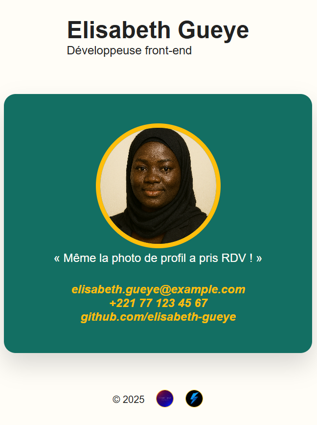

# Carte de visite – Elisabeth Gueye

[](https://github.com/Maximus203/bizcard-elisabeth-gueye)
[](https://developer.mozilla.org/fr/docs/Web/HTML)
[](https://developer.mozilla.org/fr/docs/Web/CSS)

## Description
Carte de visite numérique responsive pour Elisabeth Gueye, développeuse front-end basée à Dakar. Ce projet pédagogique met l'accent sur la sémantique HTML5 et les techniques CSS modernes pour créer une présentation professionnelle et accessible.

## Fonctionnalités
- ✅ Mise en page responsive (flexbox + grid)
- ✅ Mode clair via CSS variables
- ✅ HTML5 sémantique avec éléments `header`, `main`, `figure`, `address`, `footer`
- ✅ Accessibilité optimisée (alt text, aria labels)
- ✅ Meta tags SEO et viewport
- ✅ Favicon personnalisé
- ✅ Images optimisées

## Technologies
- HTML 5 sémantique  
- CSS 3 (variables, clamp, grid, flexbox)  
- Aucune ligne de JavaScript

## Structure du projet
```
bizcard-elisabeth-gueye/
├── index.html
├── assets/
│   ├── css/
│   │   └── style.css
│   └── img/
│       ├── portrait.png
│       ├── favicon.ico
│       ├── Cherif.png
│       ├── Artist.jpg
│       └── screen.png
└── README.md
```

## Aperçu


## Déploiement
Ce site est hébergé grâce à **GitHub Pages** – [voir le site](https://cherif-diouf.me/bizcard-elisabeth-gueye).

## Auteurs
Réalisé par **[Cherif Diouf](https://cherif-diouf.me)** pour le portefeuille pédagogique.
